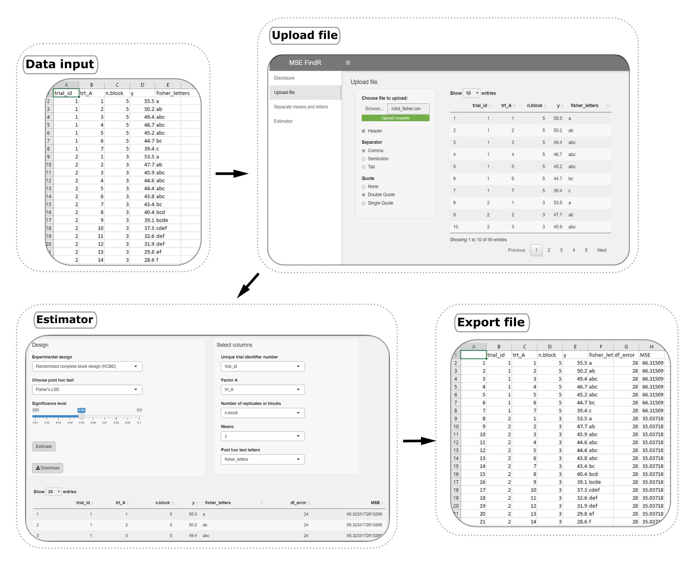

# Summary

Research synthesis methods such as meta-analysis rely on either individual participant data or appropriate summary statistics for implementation. A common problem arises when a measurement of variability is not explicitly included in scientific manuscripts or trial reports, leading to potential publication bias from having to omit otherwise credible studies from analysis. `MSE FindR` is a user-friendly R shiny web app tool to estimate the pooled variance ($S_p^2$; i.e., $MSE$) from ANOVA using information such as treatment means, $\alpha$ significance level, number of replicates, and the post hoc test results in balanced, randomized trials. Users upload a CSV file containing required information into the application, then choose an experimental design (completely randomized, randomized complete block, Latin square, two-way factorial, and split-plot designs) and the post hoc test (Fisher's $LSD$, Tukey’s $HSD$, Scheffé’s, and multiple comparison tests with Bonferroni or Šidák corrections) that were applied in the analysis of underlying data. `MSE FindR` then proceeds with the designated information to estimate $MSE$ that can subsequently be used to calculate variability measurements required in meta-analysis methods. Validation performed on simulated data demonstrated a strong correlation (0.66 $\leq$ $\rho$ $\leq$ 0.98) between ANOVA and `MSE FindR` estimated variances. With this tool, researchers can conveniently obtain an estimate of variability from published reports with missing information, enabling the inclusion of studies in future quantitative review of research data.

# Statement of need

In many situations in the synthesis of quantitative research, researchers have limited access to the individual participant data used to generate the summary information presented in a scientific manuscript. When data and statistical procedures are fully available, validation and replication of research results can be conducted, and the reuse of existing research data can further enhance future inferential analysis, for example, of product efficacy across multiple independent studies.

In the absence of individual participant data, the standard approach to meta-analysis of continuous outcomes relies on metrics such as the mean and either the standard deviation, variance, or standard error values for each treatment group [@Higgins2011]. A common problem arises when none of these critical metrics are explicitly included in the scientific manuscript nor can be directly estimated from supporting information in the trial report. In such situations, the systematic reviewer can either omit the trial from the meta-analysis, which generates additional concerns over the introduction of potential bias and loss of precision, or alternatively, find a method for deriving the missing information based on the supporting information embedded in the trial report [@Weir2018]. Supporting information commonly included in scientific reports of agricultural journals are, for example, the least significant difference value ($LSD$) from Fisher’s test, the honest significant difference value ($HSD$) from Tukey’s test, the coefficient of variation ($CV$), $p-value$, among others. However, in several instances, critical or supporting information are missing, making the inclusion of these trials in future meta-analyses burdensome.

In ANOVA, one of the assumptions is that the variance is constant across treatment groups in the data and the pooled variance ($S_p^2$; i.e., $MSE$) is an unbiased estimate of the population variance ($\sigma^2$). Note that $MSE$ is a single value that describes the variability of all groups means and coincides with the residual variance in one-way ANOVA experiments. Thus, the $MSE$ is a valid measurement to calculate the standard deviation, a critical metric in quantitative research synthesis [@Koricheva2013]. Herein, $MSE$ and $\hat\sigma^2$ will be used interchangeably. 

Post hoc tests (also known as mean separation or multiple comparison tests) are extensively adopted in the analysis of results of randomized trials in agricultural research studies. In post hoc procedures, the pairwise mean differences are compared against a test statistic, which is computed using, among other information, $\hat\sigma^2$. For any study with a significant post hoc test within a collection of means, the actual value of a test statistic, $LSD$ for example, ranges between the largest nonsignificant difference and the smallest significant difference of the treatment means. @Ngugi2011 outlined this concept and proposed a method to obtain $\hat\sigma^2$ from trials with missing estimates of variability by computing values of these finite boundaries above and averaging them for a parameter called $ELSD$, in Fisher’s $LSD$ test. The $ELSD$ is then imputed in the respective post hoc test formula where the $\hat\sigma^2$ is to be estimated [@Ngugi2011].

`MSE FindR` consists of multiple algorithms and post hoc functions developed to obtain $\hat\sigma^2$ from ANOVA studies with missing variability metrics that, alternatively, report treatment means, post hoc tests, and other basic information. The tool expands on concepts published in @Ngugi2011 by incorporating additional post hoc tests (Tukey’s $HSD$, Bonferroni and Šidák correction for multiple comparisons, and Scheffé’s test obtained from @agricolae2021, @emmeans2022, and @multcomp2008 R packages) and a variety of experimental designs commonly used in agricultural sciences.

# Software implementation

`MSE FindR` comprises four main modules (Disclosure, Upload file, Separate means and letters, and Estimator) arranged in an intuitive interface that guides the user through the analysis (Figure 1). 

{width=60%}

In its current version, the tool supports the estimation of $\hat\sigma^2$ for randomized, balanced trials arranged in the following experimental designs:

* Completely randomized design (CRD)
* Randomized complete block design (RCBD)
* Latin Square
* Two-way complete factorial as CRD
* Two-way complete factorial as RCBD
* Split-plot arranged as CRD
* Split-plot arranged as RCBD

and post hoc tests:

* Fisher's $LSD$
* Tukey's $HSD$
* Bonferroni correction for multiple comparisons
* Šidák correction for multiple comparisons
* Scheffé's test

{width=90%}

# Performance

Table 2 presents Pearson’s correlation coefficients for all methods and experimental designs handled by `MSE FindR`. Approximately 5000 trial simulations were performed with $\alpha$ set at 0.05 and varying treatment effect sizes, levels for A and B (in parenthesis), and replicates or blocks (3 to 5 – except Latin square design).

Table 2. Pearson’s correlation coefficients measuring the agreement between $\hat\sigma^2$ obtained from ANOVA and `MSE FindR` for experimental designs, treatment structure, and post hoc tests.

| Experimental design  |      Factor of interest            | Post hoc test                                               |
|----------------------|------------------------------------|--------------|-------------|------------|-------|-----------|
|                      |                                    | Fisher's LSD | Tukey's HSD | Bonferroni | Šidák | Scheffé's |
| CRD                  | A (4–16)                           | 0.905        |    0.915    |    0.906   | 0.906 |   0.902   |
| RBCD                 | A (4–16)                           | 0.945        |    0.935    |    0.938   | 0.937 |   0.928   |
| Latin square         | A (4–8)                            | 0.868        |    0.908    |    0.919   | 0.919 |   0.916   |
| 2-way factorial CRD  | A (4–6) × B (4–5)                  | 0.996        |    0.988    |    0.986   | 0.986 |   0.960   |
| 2-way factorial CRD  | A (4–7), B omitted (4–5)           | 0.440        |    0.597    |    0.586   | 0.588 |   0.605   |
| 2-way factorial RCBD | A (4–6) × B (4–5)                  | 0.996        |    0.989    |    0.988   | 0.988 |   0.961   | 
| 2-way factorial RCBD | A (4–7), B omitted (4–5)           | 0.440        |    0.603    |    0.597   | 0.596 |   0.619   | 
| Split-plot CRD       | A (4–6) main plot, B omitted (4–5) | 0.769        |    0.758    |    0.759   | 0.759 |   0.761   |
| Split-plot CRD       | B (4–6) subplot, A omitted (4–5)   | 0.599        |    0.683    |    0.695   | 0.698 |   0.698   |
| Split-plot CRD       | B (4–6) within A (4–5)             | 0.922        |    0.894    |    0.890   | 0.891 |   0.880   |
| Split-plot RCBD      | A (4–6) main plot, B omitted (4–5) | 0.765        |    0.782    |    0.782   | 0.782 |   0.785   |
| Split-plot RCBD      | B (4–6) subplot, A omitted (4–5)   | 0.605        |    0.685    |    0.699   | 0.698 |   0.705   |
| Split-plot RCBD      | B (4–6) within A (4–5)             | 0.925        |    0.897    |    0.893   | 0.895 |   0.881   |

Based on simulated data, a strong agreement between $\hat\sigma^2$ obtained from ANOVA and `MSE FindR` was observed for one-way designs and 2-way designs when interaction A × B are included. Conversely, less agreement is observed for two-way designs with one factor omitted from the analysis, due to the limited information available to estimate $ELSD$ and $\hat\sigma^2$ under such scenarios.Noteworthy, the precision of $\hat\sigma^2$ estimation increases as the number of levels in the factor increases (data not shown).

# Availability and Community Guidelines

The software is available at the GitHub repository (https://github.com/vcgarnica/MSE_FindR), which also contains the source code for this paper. Users and contributors are welcome to make suggestions, request features, and report bugs in this GitHub repository.

# Conclusions

`MSE FindR` is a user-friendly interface that facilitates the extraction of pooled variance from manuscripts lacking measurement of variability and which, alternatively, report treatment means, post hoc tests, and other commonly available information in scientific reports. We aim to continue to expand `MSE FindR` functionalities by incorporating new experimental designs and post hoc tests.

#	Acknowledgments

We wish to thank Dr. Felipe Dalla Lana (Louisiana State University), Dr. Mladen Cucak (The Pennsylvania State University), Olanrewaju Shittu (The Pennsylvania State University), Dr. Wanderson Bucker Moraes (The Ohio State University) for giving helpful comments on the documentation and application development.

# References